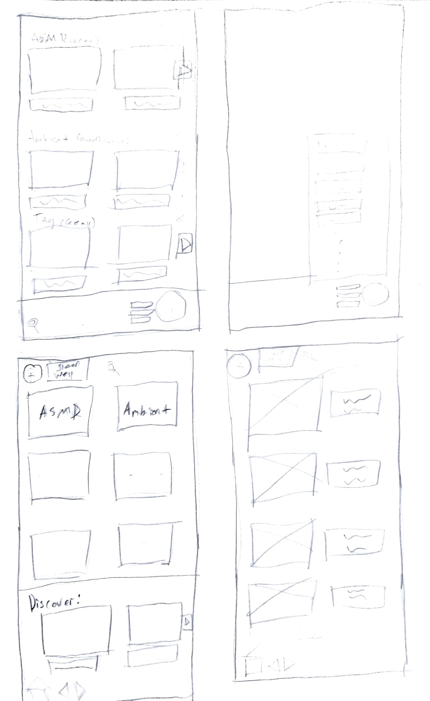

# Sketches
#### Our sketches were basic drawings of what we thought the app could look like. Showing some different screens, and the general layout of the app.

**Caleb Besser's Sketch**

 

**Derek Bergman's Sketch**

My thought main thought was to have two seperate feeds, home(left) and tags(right). Home would mainly expose the user to tags that they've selected while also displaying other video suggestions based on videos they've watched tags. The tag feed would only show the user videos with tags they've explicitly selected while allowing them to edit what tags should be currently be displayed. The last important aspect is having the search option on the bottom of the page, I find it annoying when apps have search at the top while using my phone one handed. 
