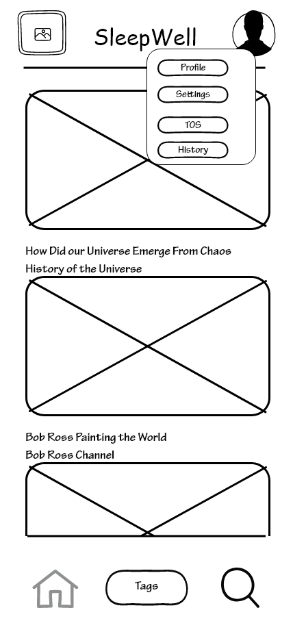
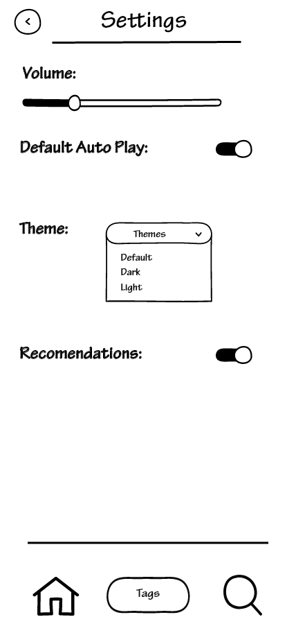
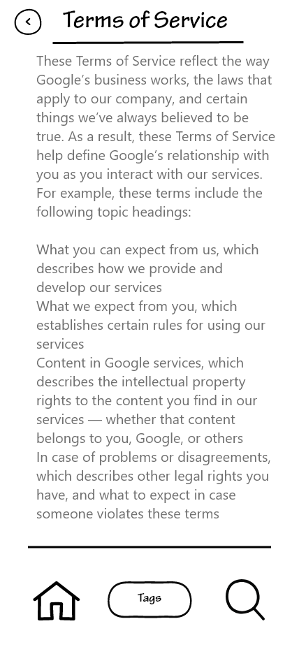

# Wireframes

**Login Screens**
- To begin, you have the start screen. If you have an account you go to login, if not, you go to the create an account screen.

       
  
  

**Main Screens**
- Once logged in, you are greeted with your default view. This shows videos reccomended based on recent activity. The bottom bar allows you to search, go to your tags page, or go back to the home screen. On the tags screen you can filter by tags that you want, which will show you only videos with those tags.

       
  
  
  

**Video Watching**
- From the Main page you can click a video and get taken to the video playing screen. Here you can set a timer, which turns off the video after a time. Change video settings, or see info about said video. You also get more reccomendations of similar videos.

         
  
  

**User Dropdown**
- For users, you can click your profile icon in the top bar. This dropdown can lead you to the settings screen, Terms of Service screen, or your profile page.

         
  
  

**Profile Page (User)**
- For non content creating users, on your profile page you will see you channel page. This shows you your selected tags, and allows you to choose more or unselect ones you already chose. If you have made videos, they will show here as well. On the About section, you can put information about you, and on the history page you can see videos you liked, and videos you recently watched.

         
  
  

**Content Creators**
- For content creators, you have an upload video screen. __**WIP**__
